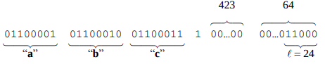
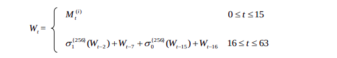
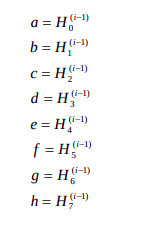
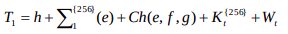
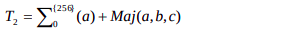
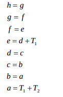
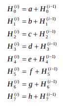
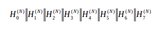

Basic implementation of the SHA-256 hashing algorithm, as outlined in the NIST FIPS PUB 180-4 standard (https://nvlpubs.nist.gov/nistpubs/FIPS/NIST.FIPS.180-4.pdf). 

### Disclaimer: 

If you're looking for an SHA-256 implementation to secure your nuclear launch codes, encrypt your top-secret cat videos, or power your underground cryptocurrency casino, well... you've come to the wrong place. This code is not intended for production use. It is not optimized for speed, memory usage, or security. 

But hey, if you're a curious soul who wants to peek inside the hashing sausage factory, or a digital archaeologist excavating the ruins of SHA-256, then welcome! This code is your shovel (a slightly wobbly, plastic one, mind you).

Just remember, this is about as practical as using a butter knife to build a spaceship. So grab your metaphorical popcorn, put on your safety goggles, and enjoy the educational fireworks!

P.S. If you do manage to crack the something using this code, please send pizza. I am not judging (much).


### SHA-256

SHA-256 is a cryptographic hash function that takes an input of arbitrary length and produces a 256-bit output. It is a one-way function, meaning that it is practically impossible to invert (i.e. find the input given the output). It is also collision-resistant, meaning that it is practically impossible to find two inputs that produce the same output.


### How it works

This Algorithm can be described in two stages: 
1. Preprocessing : Preprocessing involves padding a message, parsing the padded message into m-bit blocks, and
setting initialization values to be used in the hash computation. 
2. Hash computation : The hash computation generates
a message schedule from the padded message and uses that schedule, along with functions,
constants, and word operations to iteratively generate a series of hash values. The final hash
value generated by the hash computation is used to determine the message digest. 


#### Preprocessing 

1. Padding the message : THe goal of padding is to ensure that the padded message is a multiple of 512 bits. The padding is performed as follows: 
    1. Append a single 1 bit to the message. 
    2. Append k zero bits, where k is the smallest, non-negative solution to the equation `l + 1 + k = 448 mod 512`. 
    

    3. Append the 64-bit block that is equal to the number l expressed using a binary representation (big-endian). 
    4. The resulting padded message should be a multiple of 512 bits.

2. Parsing the padded message : The padded message is parsed into N 512bit blocks. Each block is then used to generate a 64-element (Each element having 32bit size ) message schedule.

#### Constants and Functions for Hash computation

1. K constants : The K constants are used in the message schedule calculations. These constants are the first 32 bits of the fractional parts of the cube roots of the first 64 prime numbers.

```
428a2f98 71374491 b5c0fbcf e9b5dba5 3956c25b 59f111f1 923f82a4 ab1c5ed5
d807aa98 12835b01 243185be 550c7dc3 72be5d74 80deb1fe 9bdc06a7 c19bf174
e49b69c1 efbe4786 0fc19dc6 240ca1cc 2de92c6f 4a7484aa 5cb0a9dc 76f988da
983e5152 a831c66d b00327c8 bf597fc7 c6e00bf3 d5a79147 06ca6351 14292967
27b70a85 2e1b2138 4d2c6dfc 53380d13 650a7354 766a0abb 81c2c92e 92722c85
a2bfe8a1 a81a664b c24b8b70 c76c51a3 d192e819 d6990624 f40e3585 106aa070
19a4c116 1e376c08 2748774c 34b0bcb5 391c0cb3 4ed8aa4a 5b9cca4f 682e6ff3
748f82ee 78a5636f 84c87814 8cc70208 90befffa a4506ceb bef9a3f7 c67178f2
```

2. Initial Hash Values : The initial hash values, H
(0)
, are the first 32 bits of the fractional parts of the square roots of the first eight prime numbers. 
```
6a09e667 bb67ae85 3c6ef372 a54ff53a 9b05688c 510e527f 1f83d9ab 5be0cd19
```

3. Functions : The functions used in SHA-256 are defined as follows: 
    1. Ch(x, y, z) = (x ∧ y) ⊕ (¬x ∧ z)
    2. Maj(x, y, z) = (x ∧ y) ⊕ (x ∧ z) ⊕ (y ∧ z)
    3. Σ0(x) = (x rightrotate 2) ⊕ (x rightrotate 13) ⊕ (x rightrotate 22)
    4. Σ1(x) = (x rightrotate 6) ⊕ (x rightrotate 11) ⊕ (x rightrotate 25)
    5. σ0(x) = (x rightrotate 7) ⊕ (x rightrotate 18) ⊕ (x rightshift 3)
    6. σ1(x) = (x rightrotate 17) ⊕ (x rightrotate 19) ⊕ (x rightshift 10)

#### Hash Computation

Each message block, M
(1)
, M
(2)
, …, M
(N)
, is processed in order, using the following steps:

##### Step 1. Preparing Message Schedule {W} : 
The message schedule is a 64-element array of 32-bit words. 



* The first 16 words of the message schedule are obtained directly from the 512-bit block. 
* The remaining 48 words of the message schedule are calculated using the following formula: 
    ```
    Wt = σ1(Wt−2) + Wt−7 + σ0(Wt−15) + Wt−16
    ```

##### Step 2. Initializing Working Variables : 
Eight working variables, a, b, c, d, e, f, g, and h, are used to compute the hash value. These variables are initialized to the initial hash values, H(0).   


##### Step 3. Hash Computation : The hash computation consists of 64 iterations.                
In each iteration, two temporary variables (T1 and T2) are calculated. 
T1, is calculated as follows:   
   

T2 is calculated as follows: 



The working variables are updated as follows:



##### Step 4. Computing the Intermediate Hash Value : 
After all of the message blocks have been processed, the final hash value is calculated using the following formula: 



where H(i) is the i-th element of the hash value, and H(0) is the initial hash value.


##### After repeating the above steps (1-4) for all N 512bit blocks, the final hash value is obtained as follows:

